# 📊 Evidências de Funcionalidades (WS-Academy)

Este documento reúne os registros visuais que comprovam o funcionamento de todas as telas, validações e fluxos de negócio do sistema.

---

## 🔐 1. Telas Iniciais, Autenticação e Cadastro

### Menu de Entrada do Sistema
Apresentação da interface inicial do terminal.
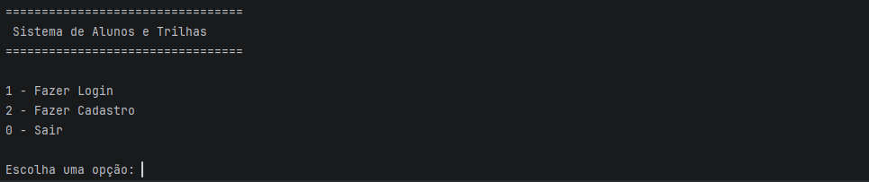

### Menu de Autenticação Básica
Opções para navegar entre as funções de Login e Cadastro.
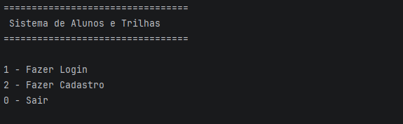

### Seleção de Perfis de Usuário
Menu de triagem para definir o tipo de conta a ser criada.
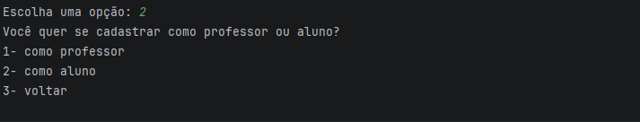

---

## 🛡️ 2. Validações do Sistema

### Interceptação de E-mail Inválido
O sistema bloqueia e rejeita entradas que não seguem o formato padrão de e-mail.
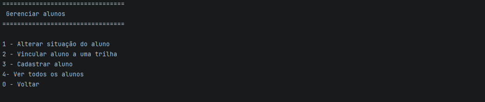

### Confirmação de Cadastro
Sucesso na criação de uma nova conta de usuário.
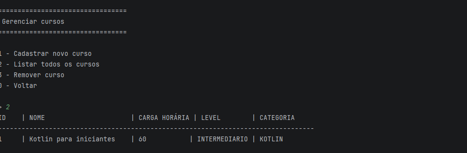

---

## 👨‍🏫 3. Módulo do Professor

### Menu Principal do Professor
Painel de controle com as opções do perfil docente.
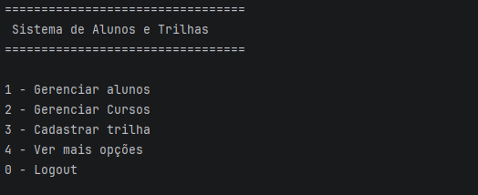

### Gerenciamento de Alunos
Tela interna destinada à administração e listagem de estudantes.
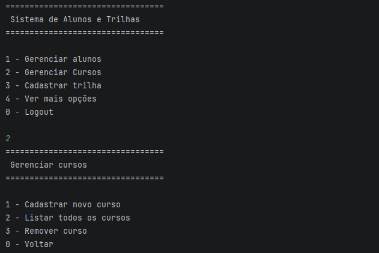

### Gerenciamento de Cursos
Catálogo geral para controle e visualização de cursos.
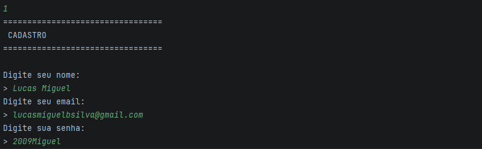

### Cadastro de Curso
Fluxo de criação de um novo curso preenchendo todos os atributos exigidos.
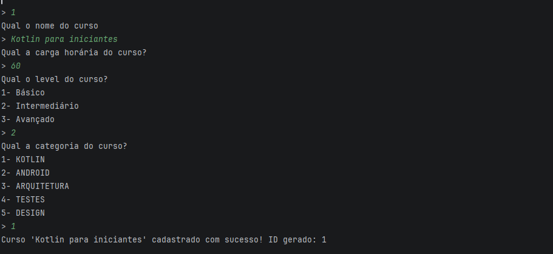

### Cadastro de Trilha
Criação de uma nova trilha pedagógica no sistema.
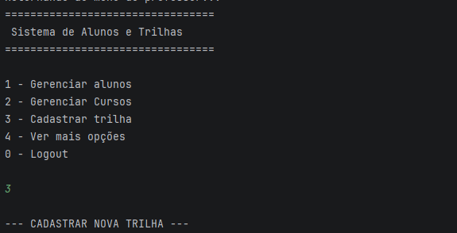

---

## ⚙️ 4. Submenu Expandido (Mais Opções)

### Menu "Mais Opções"
Aba com recursos administrativos adicionais para o professor.
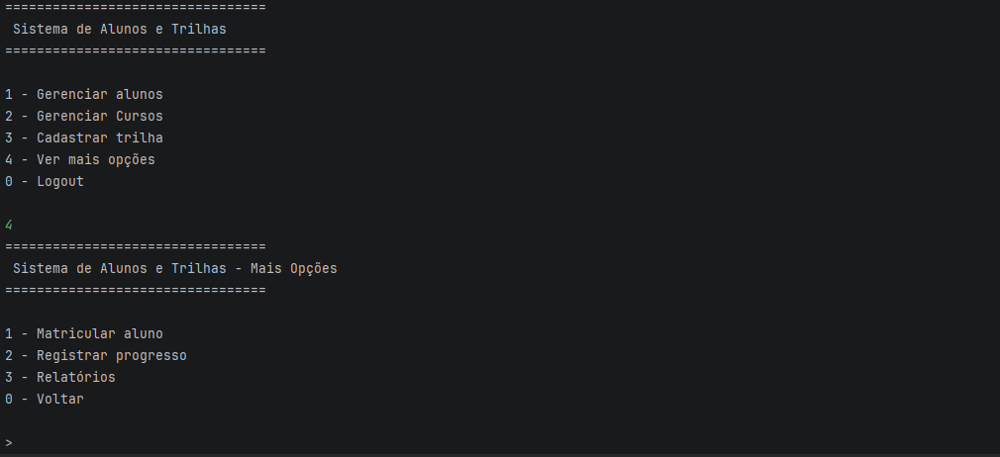

### Associação de Curso à Trilha
Vínculo de um curso existente a uma das trilhas cadastradas.
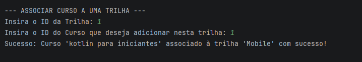

### Matrícula de Aluno em Trilha
Inclusão de um estudante em uma trilha de aprendizagem.
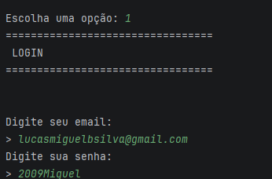

### Visualização de Progresso
Cálculo e exibição em tempo real da porcentagem de conclusão do aluno na trilha.
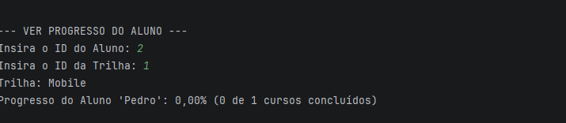

### Exportação de Relatório CSV
Geração física de arquivo de relatório para abertura direta no Microsoft Excel.
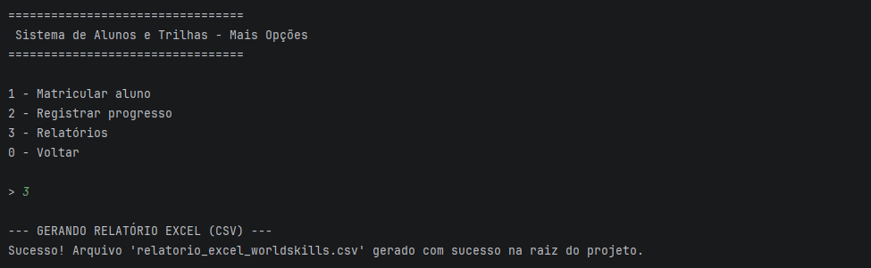

---

## 👨‍🎓 5. Módulo do Aluno

### Menu Principal do Aluno
Painel de controle exclusivo com as ações disponíveis para o estudante logado.
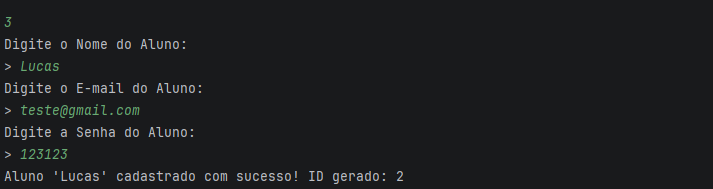

### Visualização de Trilhas e Cursos
Listagem das trilhas matriculadas e exibição do status (`⏳ Em andamento` ou `✅ Concluído`) de cada curso.
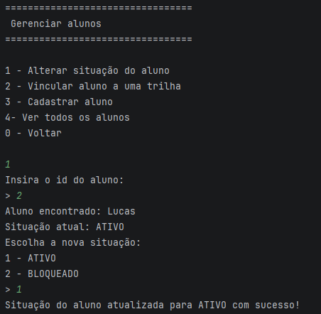

### Conclusão de Curso
Tela onde o aluno informa o ID de um curso para registrá-lo como finalizado.
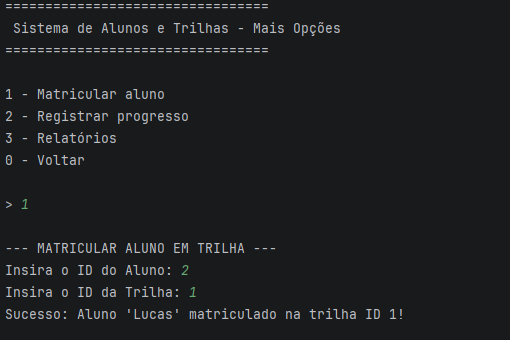

### Logout do Sistema
Encerramento de sessão seguro e retorno para a tela inicial de autenticação.
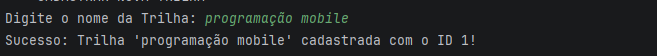
